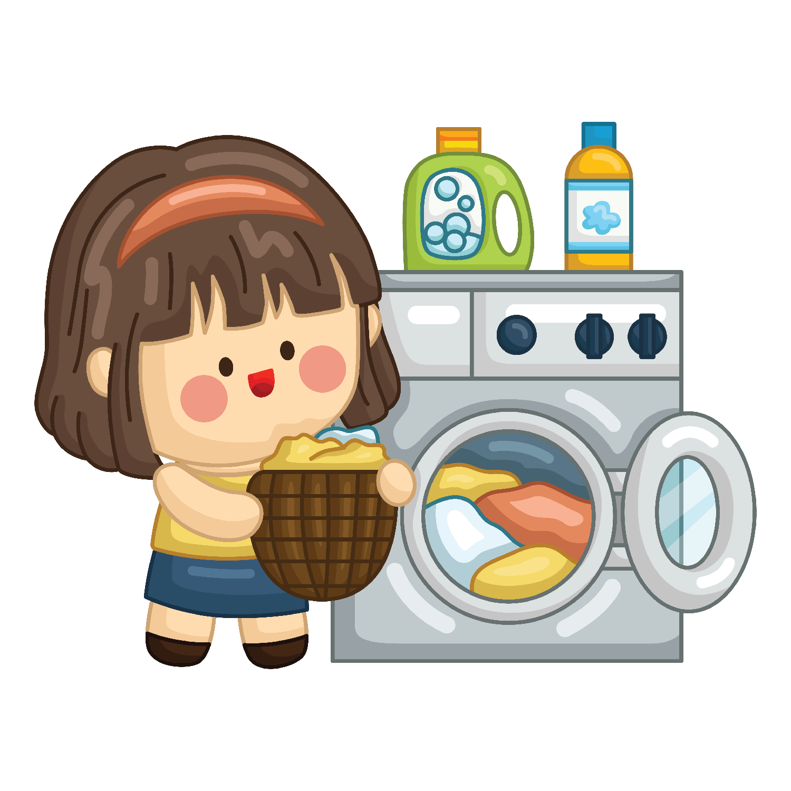

# 🧺 Match the Sock Pairs Memory Game 🧦

Match the Missing Sock Pairs is a cozy game that involves the player helping Patty match her socks so they don't go missing!

Patty has experienced so many socks get lost in her laundry machine, in her hamper, and practically all over her house! 

The player has to match 8 pairs of socks in 50 moves or less otherwise, there's a chance her socks will go missing!

[Link to play the game!](https://ssmlee10.github.io/memory-game/)

## Game Instructions

1. Click on a card to flip it over.
2. Flip another card to check if it's a match.
3. If not, they'll flip back.
4. Matched pairs will not be clickable once they are found. They will also be less opaque.
5. Match all 8 pairs of socks in 50 moves or less to win!

## Getting Started
[User Stories & Pseudocode](https://docs.google.com/document/d/1_WWRMNrkBkRLAMoWdcRns5wdnnlk12sz-SnJ3mMuA3M/edit?usp=sharing)

Here's a look at how the planning process started. I began by brainstorming what users would want to see and experience if they played a memory game. Then, I turned these stories into pseudocode. Doing this process helped me understand and create a game plan and actionable steps on how I could translate what I wanted from this game into Javascript language.

## Attributions

[W3 Schools Animated Button](https://www.w3schools.com/cSS/tryit.asp?filename=trycss_buttons_animate3):
This resource was used to create a hover state and animation when button was clicked

[Background Music](https://youtu.be/99cbvKoOyy0?si=2Y2150_Ai3-7vnx1): "Coffee Time 2"

[Bubble Click Audio](https://youtu.be/Ge2zHoXskC8?si=amvjcMLBhjAuxYI2): Bubble Click Sound Effect

[Mouse Click Audio](https://youtu.be/i0DON3AjhW4?si=2ZbR3o9x8UqFCltl): Click Sound Effect

## Technologies Used
* HTML
* CSS
* Javascript

## Next Steps
* **3 Levels of difficulty**
    * Easy: current game
    * Medium: add a 1 minute timer to complete
    * Hard: Increase socks grid to 5x5

* **Shuffle cards function**
    * When the reset button is clicked, cards will be shuffled so it will have a shuffled board

* **Style**
    * When hovering the mouse over each card, display a shadow under the card
    * Show a flipping card effect when each of the cards are clicked and clicked back
